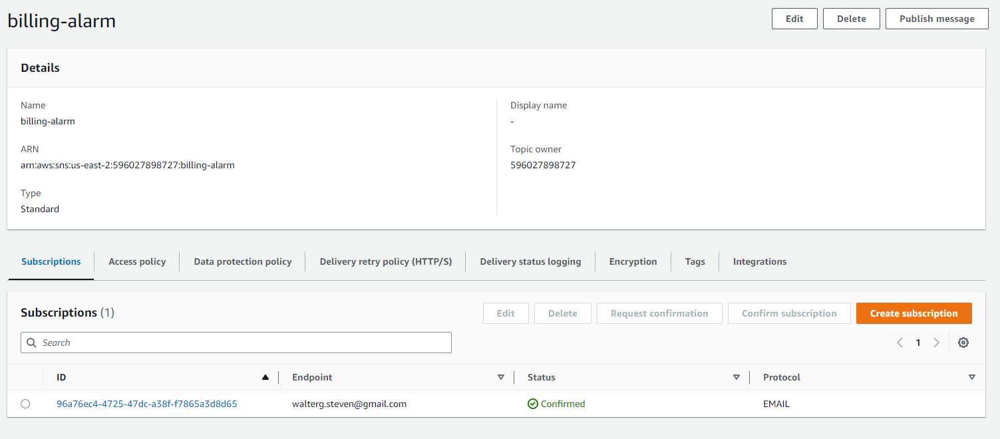

# Week 0 — Billing and Architecture

## Overview

This week we will be setting up our AWS account and getting familiar with the AWS console. We will also be setting up our project repository and getting familiar with the project codebase.

## Requirements

- [X] Create an AWS account
- [X] Create an AWS IAM user
- [X] Create a billing alarm
- [X] Create a budget
- [X] Create a GitHub repository
- [X] Create a Gitpod workspace
- [X] Configure the AWS CLI
- [X] Setup a lucidchart account
- [X] Create a lucidchart diagram of the project logical architecture
- [X] Create a Honeycomb account
- [X] Create a Rollbar account

## Tasks

### Create an AWS account

Once the account is created we need to create an IAM user. This user will be used to access the AWS console and to deploy our application.
Add the user to the `AdministratorAccess` group and create an access key for the user. Save the access key and secret key in a secure location.
Once it is created, we will need to configure the AWS CLI with the access key and secret key.


### Create a billing alarm

After that we also need to create a billing alarm. This will send us an email when our account reaches a certain threshold. This is done following the steps stated in the [AWS bootcamp Cruddr - Week 0 ](https://github.com/omenking/aws-bootcamp-cruddur-2023/blob/week-0/journal/week0.md) using the AWS CLI



### Create a budget

I also created two budgets to track my spending. I set the first to $0.01 to limit the free tier, and the second one to $100 and I will be notified when I reach 80% of that amount. I also set a notification to be sent to my email.


### Create a Github repository

I already have a Github account so I just need to create a new repository from the template. I will be using the template that was provided by the instructor. You can find it [here](https://github.com/ExamProCo/aws-bootcamp-cruddur-2023).

### Create a Gitpod workspace

I already have a Gitpod account so I just need to create a new workspace from the repository that I just created.


Also, it is necesary to create env files to store the aws credentials.


### Configure the AWS CLI

To install the AWS CLI we need to add the following script in the `.gitpod.yml` file:
```bash
  - curl "https://awscli.amazonaws.com/awscli-exe-linux-x86_64.zip" -o "awscliv2.zip"
  - unzip awscliv2.zip
  - sudo ./aws/install
```

### Setup a lucidchart account

I already have a lucidchart account, so I just need to create a new diagram and start adding the components of the project.

### Create a lucidchart diagram of the project logical architecture

I created a diagram of the logical architecture of the project. You can find it in the [following link](https://lucid.app/lucidchart/c8bd3f89-0566-420a-baad-8387c20bd052/edit?viewport_loc=-141%2C-23%2C2172%2C1028%2CYDMyL5bVe82H&invitationId=inv_8aa863b8-cee7-4e59-8aa6-2c73428c3fd7).


This is the Diagram for the conceptual architecture of the project. You can find it in the [following link](https://lucid.app/lucidchart/c8bd3f89-0566-420a-baad-8387c20bd052/edit?viewport_loc=130%2C-61%2C2931%2C1387%2C0_0&invitationId=inv_8aa863b8-cee7-4e59-8aa6-2c73428c3fd7).


### Create a Honeycomb account

I created a Honeycomb account and created a workspace for the project called walterg.steven-gettingstarted.

### Create a Rollbar account

I created a Rollbar account using my Github account. After that I will just wait for further instructions. 