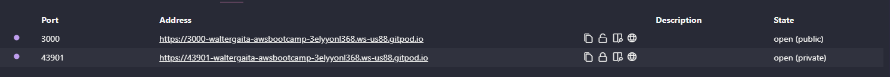
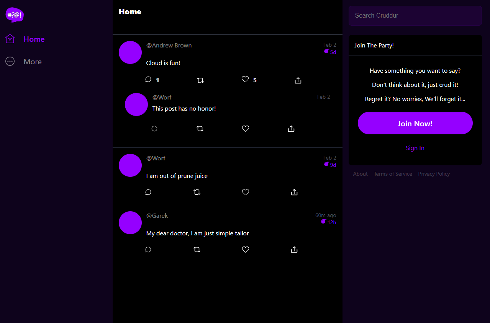

# Week 1 - App containerization

## Overview

In this week we will focus on app containerization. We will learn how to use Docker to containerize our application and make it easier to deploy and manage.

We will also cover best practices for containerization and explore the advantages and disadvantages of using containers. By the end of this week, you should be able to containerize your own application and have a better understanding of how containerization works.

## Requirements

- Basic knowledge of Linux
- Basic knowledge of AWS EC2 instances
- Basic knowledge of web servers and web development
- Docker installed and setup
- Postgres installed in Gitpod Environment

## Tasks

### Create notification feature backend

First, we need to go to the folder [backend-flask](/backend-flask) and create a Dockerfile that contains the following information:

```docker
FROM python:3.10-slim-buster

# Inside Container
# make a new folder inside container
WORKDIR /backend-flask

# Outside Container -> Inside Container
# this contains the libraries want to install to run the app
COPY requirements.txt requirements.txt

# Inside Container
# Install the python libraries used for the app
RUN pip3 install -r requirements.txt

# Outside Container -> Inside Container
# . means everything in the current directory
# first period . - /backend-flask (outside container)
# second period . /backend-flask (inside container)
COPY . .

# Set Enviroment Variables (Env Vars)
# Inside Container and wil remain set when the container is running
ENV FLASK_ENV=development

EXPOSE ${PORT}

# CMD (Command)
# python3 -m flask run --host=0.0.0.0 --port=4567
CMD [ "python3", "-m" , "flask", "run", "--host=0.0.0.0", "--port=4567"]
```

To make sure the notification feature backend works, we just need to run the command `docker build -t backend-flask .` to build the container and then `docker run backend-flask` to run the container. Once it’s created, we need to make the port public, so we can use it on the web browser.

### Create notification feature frontend

We need to do the same for our frontend and create a Dockerfile inside ```frontend-react-js``` with the following information

```docker
FROM node:16.19.0

ENV PORT=3000

COPY . /frontend-react-js
WORKDIR /frontend-react-js
RUN npm install
EXPOSE ${PORT}
CMD ["npm", "start"]
```

To test that the frontend works we need to run `docker build -t frontend-react-js .` to build the container and then `docker run -p 3000:3000 frontend-react-js` to run the container. Once it’s created, we can go to our ports and make it public, then we can access the URL in the web browser.



### Create a docker compose file

Create a docker-compose.yml file to run both the frontend and backend containers together in the same network. This will allow them to communicate with each other and make it easier to manage and deploy the application as a whole.

To create the docker-compose.yml file, we need to define the services we want to run and their configurations. We can define the services as follows:

```yaml
version: "3.8"
services:
  backend-flask:
    environment:
      FRONTEND_URL: "https://3000-${GITPOD_WORKSPACE_ID}.${GITPOD_WORKSPACE_CLUSTER_HOST}"
      BACKEND_URL: "https://4567-${GITPOD_WORKSPACE_ID}.${GITPOD_WORKSPACE_CLUSTER_HOST}"
    build: ./backend-flask
    ports:
      - "4567:4567"
    volumes:
      - ./backend-flask:/backend-flask
  frontend-react-js:
    environment:
      REACT_APP_BACKEND_URL: "https://4567-${GITPOD_WORKSPACE_ID}.${GITPOD_WORKSPACE_CLUSTER_HOST}"
    build: ./frontend-react-js
    ports:
      - "3000:3000"
    volumes:
      - ./frontend-react-js:/frontend-react-js
  db:
    image: postgres:13-alpine
    restart: always
    environment:
      - POSTGRES_USER=postgres
      - POSTGRES_PASSWORD=password
    ports:
      - '5432:5432'
    volumes: 
      - db:/var/lib/postgresql/data
  dynamodb-local:
    # https://stackoverflow.com/questions/67533058/persist-local-dynamodb-data-in-volumes-lack-permission-unable-to-open-databa
    # We needed to add user:root to get this working.
    user: root
    command: "-jar DynamoDBLocal.jar -sharedDb -dbPath ./data"
    image: "amazon/dynamodb-local:latest"
    container_name: dynamodb-local
    ports:
      - "8000:8000"
    volumes:
      - "./docker/dynamodb:/home/dynamodblocal/data"
    working_dir: /home/dynamodblocal

# the name flag is a hack to change the default prepend folder
# name when outputting the image names
networks: 
  internal-network:
    driver: bridge
    name: cruddur

volumes:
  db:
    driver: local
```

Once we have created the docker-compose.yml file, we can run it using the command `docker-compose up`  . This will build and start both containers and allow them to communicate with each other.

With this setup, we can easily manage and deploy the entire application as a single unit, making it more efficient and easier to maintain.



### Show containers information

To obtain information about the containers that are running, we can use the command `docker container ls` or `docker ps`. This will display a list of all running containers, along with their IDs, names, and other relevant information.

We can also run `docker images` to show the images built and downloaded locally.

## Homework

Create a Snyk account and analyze vulnerabilities in aws-bootcamp repository. Create a PR to solve vulnerabilities and merge it with main branch.

After watching the video on how to pick the right cloud role, I realized that I am interested in pursuing a career as a DevOps Engineer. To achieve this, I need to gain more knowledge and experience in cloud technologies such as AWS and GCP. I plan to take courses, work on personal projects, and gain hands-on experience through internships or entry-level positions in the field.

I also learned what certifications I can get, what do they cover and what are the benefits of getting certified. I plan to research these certifications further and determine which ones would be most beneficial for my career goals. I also learned that although helpful, there are more requirements to get an entry level job, that having previous experience in a similar role, and having a project that involves relevant tools is also beneficial when applying.

### My Journey to the cloud

**********************I am going to become********************** a DevOps Engineer. ************************************************I am a good fit because************************************************ I have a technical background, I got a degree in Network and Telecommunications, started working as an IT/Helpdesk, then moved to a Manual QA role, so I already have some experience working with Agile teams and with the DevOps lifecycle.

| I will know | I will not get distracted by |
| --- | --- |
| Terraform | CloudFormation |
| Docker | Web Development |
| AWS | Azure |
| Kibana | Cloudwatch |
| Github Actions | Gitlab CI |

## References

Here I will list external resources that are not part of the tasks but provide relevant information to this week's topic

First, I learned all the basics for docker and how to use it following the video from Nana

[https://www.youtube.com/watch?v=pg19Z8LL06w](https://www.youtube.com/watch?v=pg19Z8LL06w)

Then, I decided to learn more about docker compose following a video from NetworkChuck and successfully run a compose file to deploy wordpress, which contains a frontend and a MySQL database connected to each other in the same network.

[https://www.youtube.com/watch?v=DM65_JyGxCo&t=629s](https://www.youtube.com/watch?v=DM65_JyGxCo&t=629s)