# Week 2 — Distributed Tracing

## Overview

In this week we will be looking at distributed tracing. We will be looking at how to trace a request through a distributed system, and how to use tracing to debug a distributed system. 

## Requirements

[X] Have a Honeycomb account
[X] Xray installed on your machine
[X] Setup AWS CLoudwatch on the application
[X] Have a Rollbar account

## Tasks

### Task 1 — Setup Honeycomb

First we need to create a Honeycomb account. You can do this by going to [Honeycomb](https://ui.honeycomb.io/signup) and signing up. You can also follow the video from [GiftedLane](https://www.youtube.com/watch?v=7IwtVLfSD0o&list=PLBfufR7vyJJ7k25byhRXJldB5AiwgNnWv&index=11) to get started.

After doing that, in the main page you will see in the left panel a section called 'Environments'. Click on the 'Add environment' button and add a new environment. You can name it whatever you want, but I will be using 'Bootcamp' for this example.
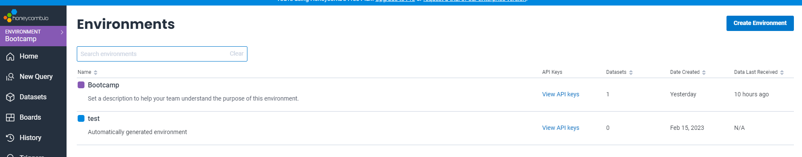

After that, in the Home page, you will see your API key. Copy it and save it somewhere, you will need it later. Below that you will also see the instructions to install the Honeycomb agent. We will be using the Python agent, since we are using Flask as backend. You can follow the instructions in the video to install the agent or refer to the Week 2 documentation from the [Bootcamp repository](https://github.com/omenking/aws-bootcamp-cruddur-2023/blob/week-2/journal/week2.md).

Once everything is installed, you can start the application and make a request to it. You should see the request in the Honeycomb dashboard.
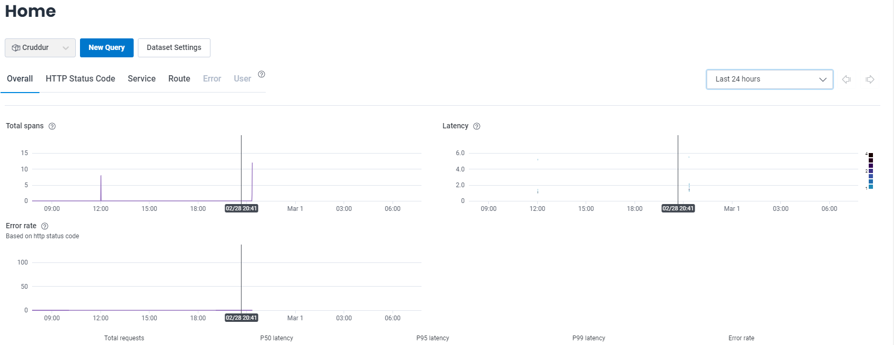

Then we need to perform a query to get traces. Click on `New Query` and then select `COUNT DISTINCT` in the Visualize section and `trace.trace_id` in the Group By section. You should see something like this after you run the query.
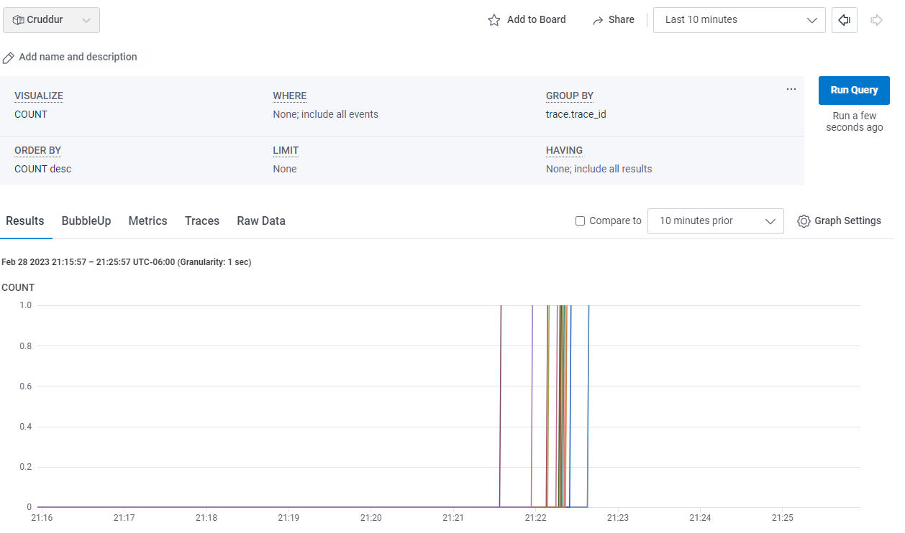

After doing that, if you go to the Traces section, you will see the traces for the request you just made. You can click on the trace and see the details of the request.
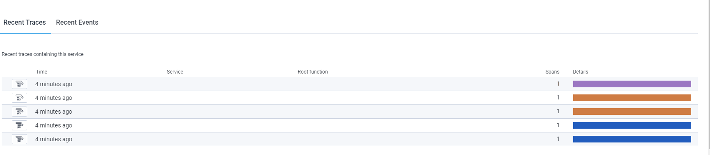

### Task 2 — Setup Xray on the application

We need to make sure that Xray is installed in the program. You can follow the instructions in the Week 2 documentation from the [Bootcamp repository](https://github.com/omenking/aws-bootcamp-cruddur-2023/blob/week-2/journal/week2.md).

In my case, instead of using:
```shell
export AWS_REGION="ca-central-1"
gp env AWS_REGION="ca-central-1"
```

I used
```shell
export AWS_REGION="us-east-2"
gp env AWS_REGION="us-east-2"
```

After that, we need to make sure that Xray is enabled in the application. You can do this by adding the following lines to the `app.py` file:
```python
from aws_xray_sdk.core import xray_recorder
from aws_xray_sdk.ext.flask.middleware import XRayMiddleware

xray_url = os.getenv("AWS_XRAY_URL")
xray_recorder.configure(service='Cruddur', dynamic_naming=xray_url)
XRayMiddleware(app, xray_recorder)
```

We also need to add the following to the requirements.txt file:
```
aws-xray-sdk
```

Once that is done, we can start the application and make a request to it. You should see the request in the Xray dashboard.
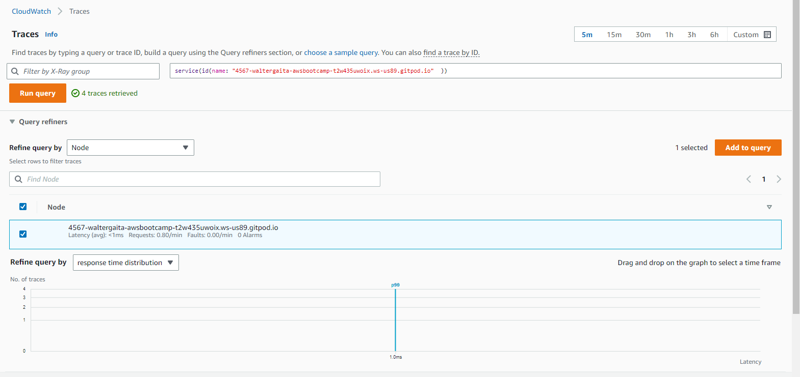

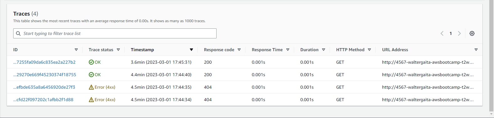

### Task 3 — Setup Cloudwatch

We need to make sure that Cloudwatch is installed in the program. You can follow the instructions in the Week 2 documentation from the [Bootcamp repository](https://github.com/omenking/aws-bootcamp-cruddur-2023/blob/week-2/journal/week2.md).

Following the instructions, we see that we need to add the ACCESS KEY and SECRET KEY to the application in Docker Compose, add `watchtower` to the requirements.txt file, and add the following to the `app.py` file:
```python
import watchtower
import logging
from time import strftime

# Configuring Logger to Use CloudWatch
LOGGER = logging.getLogger(__name__)
LOGGER.setLevel(logging.DEBUG)
console_handler = logging.StreamHandler()
cw_handler = watchtower.CloudWatchLogHandler(log_group='cruddur')
LOGGER.addHandler(console_handler)
LOGGER.addHandler(cw_handler)
LOGGER.info("some message")
@app.after_request
def after_request(response):
    timestamp = strftime('[%Y-%b-%d %H:%M]')
    LOGGER.error('%s %s %s %s %s %s', timestamp, request.remote_addr, request.method, request.scheme, request.full_path, response.status)
    return response
```

After that, we can start the application and make a request to it. You should see the request in the Cloudwatch dashboard.
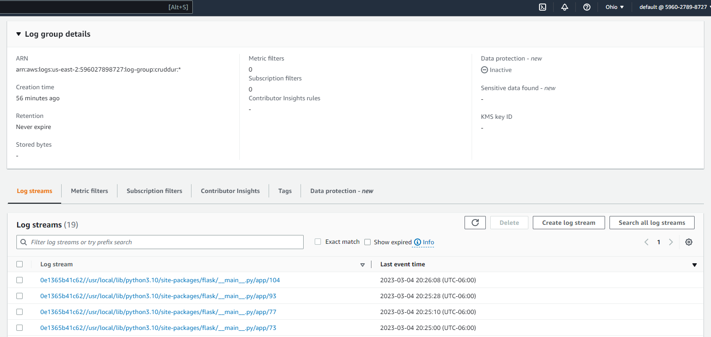

We also need to modify the `home_activities.py` file to add the following lines:
```python

tracer = trace.get_tracer("home.activities")

class HomeActivities:
  def run(Logger):
    Logger.info("HomeActivities")
```

I personally had some issues with `home_activities.py` since I was getting a NameError. I fixed this by changing the line 8 from:
```python
logger.info("HomeActivities")
```
To:
```python
Logger.info("HomeActivities")
```

Once I used Capital L, it worked and started getting a JSON response.

And the `app.py` file to add the following lines:
```python
@app.route("/api/activities/home", methods=['GET'])
def data_home():
  data = HomeActivities.run(Logger=LOGGER)
  return data, 200
  ```

Finally, I checked that the logs were showing the messages I added in the `app.py` file.
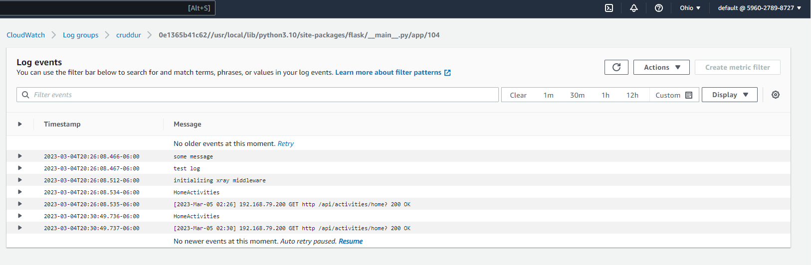

### Task 4 — Setup Rollbar

After following the video from [Andrew Brown](https://www.youtube.com/watch?v=xMBDAb5SEU4&list=PLBfufR7vyJJ7k25byhRXJldB5AiwgNnWv&index=37)
I was able to setup Rollbar and get the errors in the dashboard just by adding the following lines to the `app.py` file:
```python
import rollbar
import rollbar.contrib.flask
from flask import got_request_exception
```
```python
rollbar_access_token = os.getenv('ROLLBAR_ACCESS_TOKEN')
@app.before_first_request
def init_rollbar():
    """init rollbar module"""
    rollbar.init(
        # access token
        rollbar_access_token,
        # environment name
        'production',
        # server root directory, makes tracebacks prettier
        root=os.path.dirname(os.path.realpath(__file__)),
        # flask already sets up logging
        allow_logging_basic_config=False)

    # send exceptions from `app` to rollbar, using flask's signal system.
    got_request_exception.connect(rollbar.contrib.flask.report_exception, app)
```
```python
@app.route('/rollbar/test')
def rollbar_test():
    rollbar.report_message('Hello World!', 'warning')
    return "Hello World!"
```

I also added the following to the `docker-compose.yml` file:
```yaml
ROLLBAR_ACCESS_TOKEN: "${ROLLBAR_ACCESS_TOKEN}"
```
Finally, I successfully got the errors in the Rollbar dashboard.
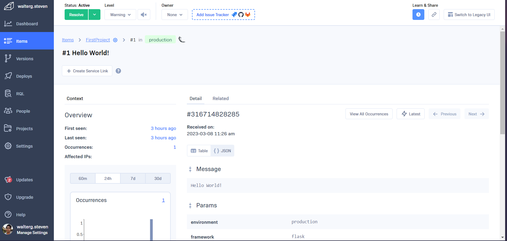
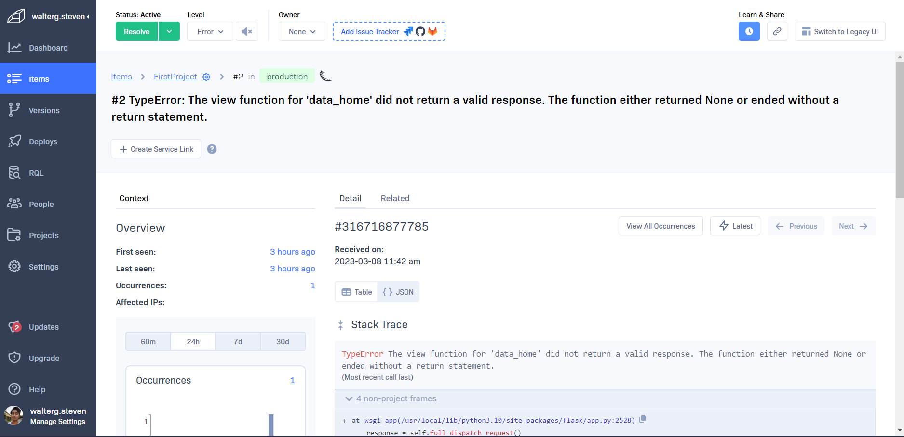

### Task 5 — Setup Xray subsegment

I added the following lines to the `app.py` file starting at Line 155:
```python
@app.route("/api/activities/home", methods=['GET'])
@xray_recorder.capture('activities_home')
def data_home():
  data = HomeActivities.run(Logger=LOGGER)
  return data, 200

@app.route("/api/activities/@<string:handle>", methods=['GET'])
@xray_recorder.capture('activities_users')
def data_handle(handle):

@app.route("/api/activities/<string:activity_uuid>", methods=['GET'])
@xray_recorder.capture('activities_show')
def data_show_activity(activity_uuid):
  data = ShowActivity.run(activity_uuid=activity_uuid)
  return data, 200

```

Added the following to `user_activities.py` file:
```python
from datetime import datetime, timedelta, timezone
from aws_xray_sdk.core import xray_recorder
class UserActivities:
  def run(user_handle):
    try:
      model = {
        'errors': None,
        'data': None
      }

      now = datetime.now(timezone.utc).astimezone()
      
      if user_handle == None or len(user_handle) < 1:
        model['errors'] = ['blank_user_handle']
      else:
        now = datetime.now()
        results = [{
          'uuid': '248959df-3079-4947-b847-9e0892d1bab4',
          'handle':  'Andrew Brown',
          'message': 'Cloud is fun!',
          'created_at': (now - timedelta(days=1)).isoformat(),
          'expires_at': (now + timedelta(days=31)).isoformat()
        }]
        model['data'] = results

      subsegment = xray_recorder.begin_subsegment('mock-data')
      # xray ---
      dict = {
        "now": now.isoformat(),
        "results-size": len(model['data'])
      }
      subsegment.put_metadata('key', dict, 'namespace')
      xray_recorder.end_subsegment()
    finally:  
    #  # Close the segment
      xray_recorder.end_subsegment()
    return model
```
Once done, we can see the changes in the Xray dashboard.
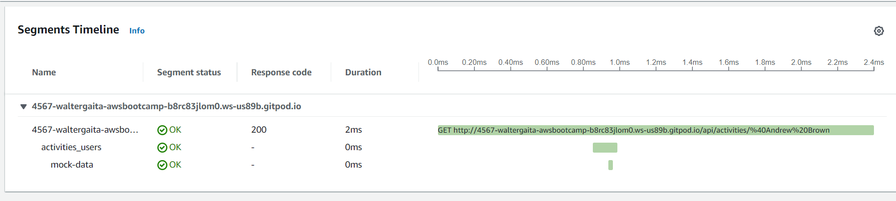

## Homework

### Task 1 - Run custom queries in Honeycomb and save them later eg. Latency by UserID, Recent Traces

I created a query to get a HEATMAP of the traces GROUPED BY the `trace_id`.
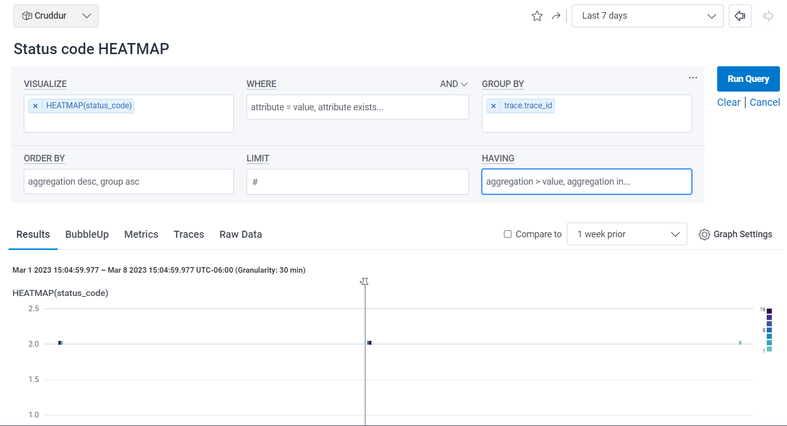

Also, I created a query to check the average duration grouped by the `trace_id`.
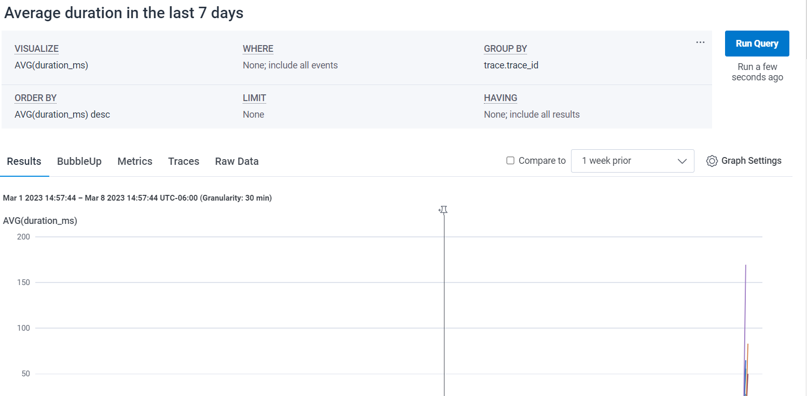

