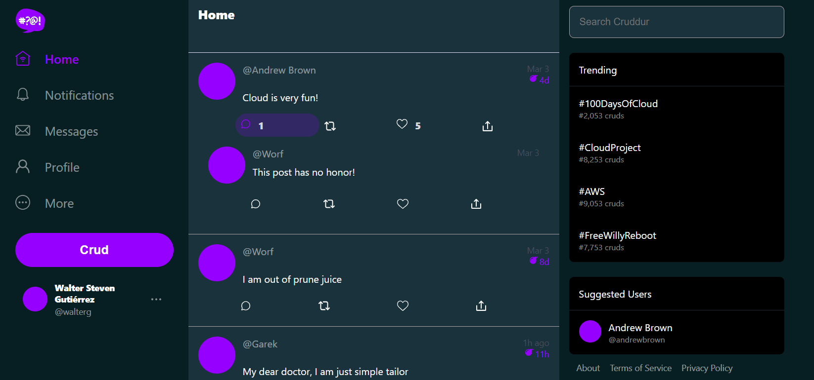

# Week 3 — Decentralized Authentication

## Overview

This week we will be learning about decentralized authentication. We will be using Amazon Cognito to create a user pool and identity pool. We will then use the AWS Amplify library to authenticate users and access protected resources.

We will also learn about JWT tokens and how to use them to authenticate users.

## Requirements

- [X] Amazon Cognito User Pool
- [X] Amazon Cognito Identity Pool
- [X] AWS Amplify Authentication
- [X] JWT Tokens
- [X] Basic CSS Styling

## Tasks

After completing the Todo checklist, which includes watching the videos and following the [repository instructions](https://github.com/omenking/aws-bootcamp-cruddur-2023/blob/week-3/journal/week3.md)
you will have a working application that uses Amazon Cognito to authenticate users and access protected resources.

It is necessary to create a user pool with the following requirements:

- [X] Username must be an email address
- [X] Only name and email are required
- [X] No MFA
- [X] Must be a public pool
- [X] No custom attributes
- [X] Password policy: Cogniito default
- [X] Only email verification
- [X] Self-service sign up


It is also necesary to pass the environment variables to the docker-compose file:

```bash
  REACT_APP_AWS_PROJECT_REGION: "${AWS_DEFAULT_REGION}"
      REACT_APP_AWS_COGNITO_REGION: "${AWS_DEFAULT_REGION}"
      REACT_APP_AWS_USER_POOLS_ID: "us-east-1_XXXXXXXXXX"
      REACT_APP_CLIENT_ID: "xxxxxxxxxxxxxxxxxxxxx"
```

And to the `app.js` file:

```javascript
import { Amplify } from 'aws-amplify';

Amplify.configure({
    "AWS_PROJECT_REGION": process.env.REACT_APP_AWS_PROJECT_REGION,
    "aws_cognito_region": process.env.REACT_APP_AWS_COGNITO_REGION,
    "aws_user_pools_id": process.env.REACT_APP_AWS_USER_POOLS_ID,
    "aws_user_pools_web_client_id": process.env.REACT_APP_CLIENT_ID,
    "oauth": {},
    Auth: {
        // We are not using an Identity Pool
        // identityPoolId: process.env.REACT_APP_IDENTITY_POOL_ID, // REQUIRED - Amazon Cognito Identity Pool ID
        region: process.env.REACT_APP_AWS_PROJECT_REGION,           // REQUIRED - Amazon Cognito Region
        userPoolId: process.env.REACT_APP_AWS_USER_POOLS_ID,         // OPTIONAL - Amazon Cognito User Pool ID
        userPoolWebClientId: process.env.REACT_APP_CLIENT_ID,   // OPTIONAL - Amazon Cognito Web Client ID (26-char alphanumeric string)
    }
});
```

It is also necessary to implement the JWT tokent to the `HomeFeedPage.js` and edit the `SignUpPage.js` file as well as the bootcamp instructions.

Once everything is done, the application should look like this:


The user should receive an email with a verification code.


And the user should be able to enter the code and confirm the account.


Once the user is logged in, the application should look like this:


### Enhance the application UI

The application is using a color convention that makes it hard to read, that is why it is necessary to change the colors of the application.

The colors that are going to be used are:

```css
:root {
  --bg: #071E22;
  --fg: #19323C;
  --bd: #ADA0A6;
}
```
These colors are going to be used in the `index.css` file to give consistency to the application and make it easier to read.

## Homework

Additionally, there was an issue with the recover page, since the letters were not being displayed correctly. 


This was fixed by adding the following line to the `index.css` file:

```css
article.recover-article .recover-wrapper {
  color: aliceblue;
}
```


