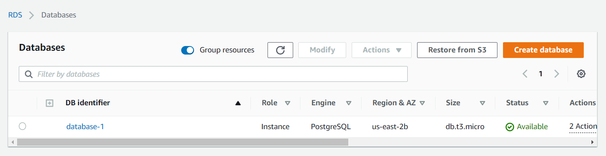
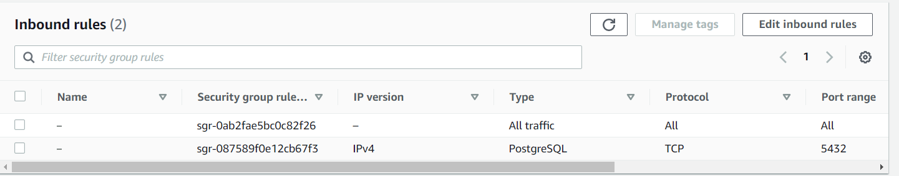
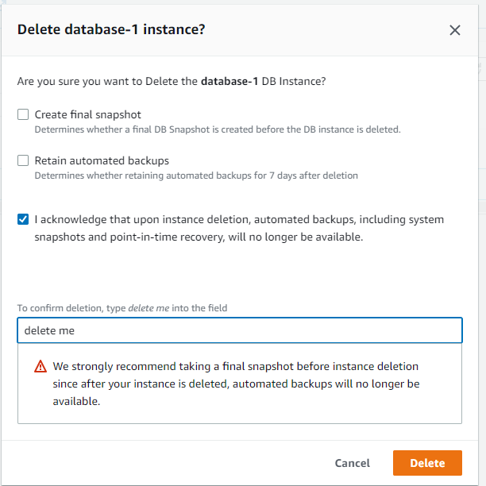
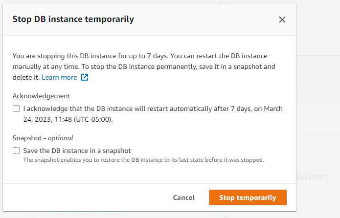

# Week 4 — Postgres and RDS

## Overview

This week we will be learning about Postgres and RDS. We will be using Amazon RDS to create a Postgres database. We will then use the AWS Amplify library to connect to the database and perform CRUD operations. They are going to be some implementations such as:
- Create a CRUD application using AWS
- Use lambda functions to perform CRUD operations
- Use DynamoDB to store data
- Use S3 to store images
- Connect to a postgres database using AWS RDS

## Requirements

- [X] Amazon RDS Postgres Database
- [X] Postgres installed on the CLI
- 
## Tasks

### Security Considerations for RDS

First we follow the video published by Ashish on [Securing your Amazon RDS Postgres](https://www.youtube.com/watch?v=UourWxz7iQg&list=PLBfufR7vyJJ7k25byhRXJldB5AiwgNnWv&index=46) and learned about typed of RDS, why companies use Amazon RDS, how to create one and how to secure it.

To create a RDS instance we need to follow the next steps:
- Go to the RDS service
- Click on `Create database`
- Select `Easy Create`
- Select `PostgreSQL`
- Generate a password
- Click on `Create database`

> **Important Note:** There are certain things that we need to take into account when creating a database.

- Make sure that the region is the same as the one you are using for the rest of the services. In this case, we are using `us-east-2`.
- It is also important to select the `Free tier` option, because it is the only one that allows us to create a database without paying. 
- Make your database publicly accessible, because it is not a good practice to do it. However, it is necessary to do it for this project.
- Finally, make sure that you have a VPC with two subnets in different AZ, and also a security group created, because you will need to select it when creating the database.



Using the `Easy Create` option, we can create a database in a few minutes. However, it is not the best option because it does not allow us to customize the database. For example, we cannot change the storage type, the storage size, the database name, the port, the database version, etc. If we want to customize the database, we need to use the `Standard Create` option.

For the security groups, it is necessary to change the default one, because it allows all the traffic. We need to create a new one and select the following options:
- Type: `PostgreSQL`
- Protocol: `TCP`
- Port Range: `5432`
- Source: `My IP`



Finally, to connect with the database, I am using `DBeaver`. It is a free and open source database management tool. It allows us to connect to different databases such as MySQL, PostgreSQL, Oracle, SQL Server, etc. To connect to the database, we need to follow the next steps:
- Click on `New Connection`
- Select `PostgreSQL`
- Select `database-1` as the database
- Paste the endpoint on the `Host` field
- Click on test connection

Once you are done with the connection, remember to delete the database, because it is not a good practice to leave it publicly accessible, and it is not free.

Since there is no data on the database, no snapshot is created. So the options selected are as shown below:


### Create a CRUD application using AWS

Following the session for the Week 4, we start by creating a RDS using the CLI. To do so, we need to follow the next steps:
- Create a VPC
- Create a subnet group
- Create a security group
- Create an RDS instance

To create a VPC, we need to follow the next steps:
- If you do not have a default VPC, just run the following command:
```bash
aws ec2 create-default-vpc
```
- Once you run the command, default subnets will also be created. To check if the default VPC was created, run the following command:
```bash
aws ec2 describe-vpcs
```

To create a subnet group, we need to follow the next steps:
- Run the following command:
```bash
aws rds create-db-subnet-group --db-subnet-group-name subnet-group-1 --db-subnet-group-description "Subnet group 1" --subnet-ids subnet-0a1b2c3d4e5f6g7h8 subnet-0a1b2c3d4e5f6g7h9
```
- To check if the subnet group was created, run the following command:
```bash
aws rds describe-db-subnet-groups
```

To create an RDS instance, we need to follow the next steps:
- Run the following command:
```bash
aws rds create-db-instance \
  --db-instance-identifier cruddur-db-instance \
  --db-instance-class db.t3.micro \
  --engine postgres \
  --engine-version  14.6 \
  --master-username root \
  --master-user-password ${MASTER_PASSWORD} \
  --allocated-storage 20 \
  --availability-zone us-east-2a \
  --backup-retention-period 0 \
  --port 5432 \
  --no-multi-az \
  --db-name cruddur \
  --storage-type gp2 \
  --publicly-accessible \
  --storage-encrypted \
  --enable-performance-insights \
  --performance-insights-retention-period 7 \
  --no-deletion-protection
```

For security reasons, I am not going to show the password. However, you can use your own password. To add the password without modifying the command, you can run the following command in the CLI:
```bash
export MASTER_PASSWORD=your_password
gp env MASTER_PASSWORD=your_password
```

- To check if the RDS instance was created, run the following command:
```bash
aws rds describe-db-instances
```

In previous weeks, postgres was already set up. However, if not, it is necessary to go to the docker-compose and add the following lines:
```yaml
  db:
    image: postgres:13.5-alpine
    restart: always
    ports:
      - 5432:5432
    environment:
      POSTGRES_PASSWORD: password
      POSTGRES_USER: postgres
    volumes:
      - ./db:/var/lib/postgresql/data
```

To avoid spending in the RDS, we need to stop it temporarily. To do so, we need to follow the next steps:
- Go to your RDS instance
- Click on `Actions`
- Click on `Stop Temporarily`
- Acknowledge the message


To connect to the local database, we need to follow the next steps:
- Run the docker-compose
- Run the following command:
```bash
psql -Upostgres --host localhost
```
- Create the database
```sql
CREATE DATABASE cruddur;
```
- Use the command `\l` to show the databases
- Add schema to `schema.sql` file inside the `db` folder
```sql
CREATE TABLE public.users (
  uuid UUID DEFAULT uuid_generate_v4() PRIMARY KEY,
  display_name text,
  handle text,
  cognito_user_id text,
  created_at TIMESTAMP default current_timestamp NOT NULL
);

CREATE TABLE public.activities (
  uuid UUID DEFAULT uuid_generate_v4() PRIMARY KEY,
  message text NOT NULL,
  replies_count integer DEFAULT 0,
  reposts_count integer DEFAULT 0,
  likes_count integer DEFAULT 0,
  reply_to_activity_uuid integer,
  expires_at TIMESTAMP,
  created_at TIMESTAMP default current_timestamp NOT NULL
);
```

### Create scripts to set up and create the database

To create the scripts, we need to follow the next steps:
- Create a folder called `bin`
- Create the files `db-create`, `db-drop`, `db-schema-load`
- Copy the content of the files from the repository


