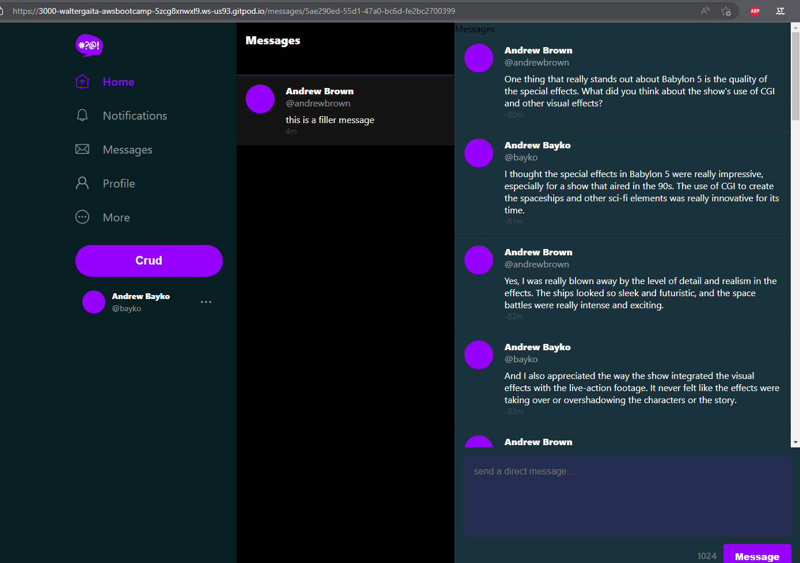

# Week 5 — DynamoDB and Serverless Caching

## Table of Contents

- [X] Watched Week 5 - Data Modelling (Live Stream)
- [X] Watched Ashish's Week 5 - DynamoDB Considerations
- [X] Implement Schema Load Script
- [X] Implement Seed Script
- [X] Implement Scan Script
- [X] Implement Pattern Scripts for Read and List Conversations
- [X] Implement Conversations with DynamoDB
- [X] Implement DynamoDB Stream

### Tasks

#### Watched Week 5 - Data Modelling (Live Stream)
In this video, I learned about creating a data modelling, we didn't start creating any database, just defining the data model. I learned about the following:
- Data Modelling
- Data Modelling Patterns
- Data Modelling Patterns for Messages

#### Watched Ashish's Week 5 - DynamoDB Considerations
In this video, I did the following:
- Learned about DynamoDB
- Created a DynamoDB table
- Added a tag to the table
- Created some items
- Created a cluster, this option does cost money, so be mindful of that
- Learned about security best practices

### Implement Schema Load, Seed, and Scan Script
In this task, I did the following:
- Added `boto3` to the `requirements.txt` file
- Create a new `schema-load`, `seed`, and `drop` in the folder `ddb`
- Modify `bd/seed` and `seed.sql` for the last one, I added my own username
- Recreate SQL database using `setup`
- Create a new `ddb` database using `ddb/schema-load`
- Seed the `ddb` database using `ddb/seed`
- Scan the `ddb` database using `ddb/scan`

### Implement Pattern Scripts for Read and List Conversations
In this task, I did the following:
- Create a new `ddb/patterns` folder in the `scripts` folder
- Create a new `ddb/patterns/read-conversation` script'
- Create a new `ddb/patterns/list-conversations` script

### Implement Conversations with DynamoDB

In this task, many things happened, I did the following:
- Create a new `ddb/patterns` folder in the `bin` folder and created get and list conversation scripts
- Create update_cognito_user_id in the `db` folder
- Modify backend files such as `app.py`, `message_groups.py`, `messages.py`, `users.py`, and `ddb.py`
- Update frontend pages such as `ConfirmationPage.js`, `NotificationsFeedPage.js`, `RecoversPage.js`, `SignInPage.js`, `SignUpPage.js`, `UserPage.js`, `UserSettingsPage.js`, `UsersPage.js`, `index.js`, `App.js`, you can see all these changes in the commit history `Fix dynamo db spell in docker compose`
- For the docker compose file, I added a new line `DYNAMO_DB_ENDPOINT: http://dynamodb:8000` in the backend service:
```yaml
backend-flask:
  environment:
    AWS_ENDPOINT_URL: "http://dynamodb-local:8000"
```
- After all these changes, I ran `docker-compose up` and it worked, then updated the db using the script `db/setup` and it worked
- I also updated the `ddb/schema-load` script to create the `ddb` database
- I also updated the `ddb/seed` script to seed the `ddb` database
- I had some issues with doing the schema load, so just make sure that you run `update_cognito_user_id` before running `schema-load` and that you have a username named `waltergsteven` in the `users` table or that you modified all the necessary files to your own username such as `ddb/seed`, `db/seed`, and `app.py`
- Once I did all the changes, I signed in and went to the `messages` page, and it showed the messages, so I was able to create a conversation and send a message to it.

### Implement DynamoDB Stream

In this task, I did the following:
- Create a users folder in `db` with the following files: `create_message_users.sql`, `short.sql`, `uuid_from_cognito_user_id.sql`
- Modify the `app.js` file add the new paths
- Create the `cruddur-messaging-stream.py` in the lambda folder
- Create the `cruddur-policy.json` for the new lambda function
- Modify the `schema-load` in the `ddb` folder
- Comment the endpoint url in the `docker-compose.yml` file



## Homework

This has been the most difficult week so far, so I'm going to take a break from the homework and just focus on the next week's material. Although I did make some improvements in the `setup` script, and also created a new script called `initial-setup` to run the `setup` script, as well as the `schema-load` and `seed`
```shell
#!/bin/bash

# Set variables
BIN_PATH="$(realpath .)/bin"
DB_PATH="$BIN_PATH/db"
DDB_PATH="$BIN_PATH/ddb"

# Run db setup and catch errors
if source "$DB_PATH/setup"; then
  # Load schema and seed data if setup was successful
  source "$DDB_PATH/schema-load"
  source "$DDB_PATH/seed"
else
  # If setup failed, print error message and exit script
  echo "Error running db setup. Schema load and seed will not be executed."
  exit 1
fi
```
```shell
#! /usr/bin/bash
set -e # stop if it fails at any point

CYAN='\033[1;36m'
NO_COLOR='\033[0m'
LABEL="db-setup"
printf "${CYAN}==== ${LABEL}${NO_COLOR}\n"

bin_path="$(realpath .)/bin"

if [[ $(psql -U postgres -h localhost -lqt | cut -d \| -f 1 | grep -wq "cruddur") ]]; then
  echo "Database already exists, skipping drop"
else
  source "$bin_path/db/drop"
fi

source "$bin_path/db/create"

if [[ $(psql -U postgres -h localhost -lqt | cut -d \| -f 1 | grep -wq "cruddur") ]]; then
  echo "Database exists, running schema load and seed"
  source "$bin_path/ddb/schema-load"
  source "$bin_path/ddb/seed"
else
  echo "Database not found, skipping schema load and seed"
fi
```

These scripts have not been tested yet, but I will test it later.