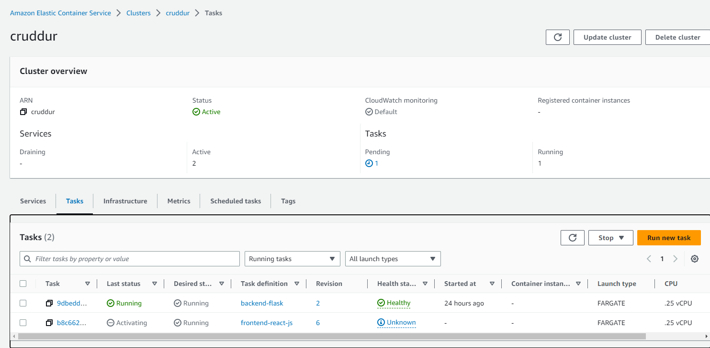
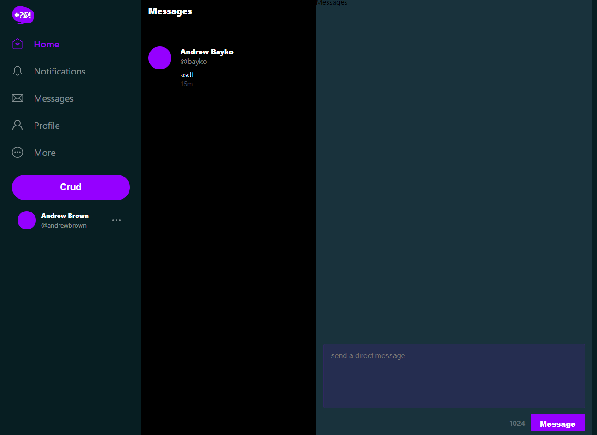
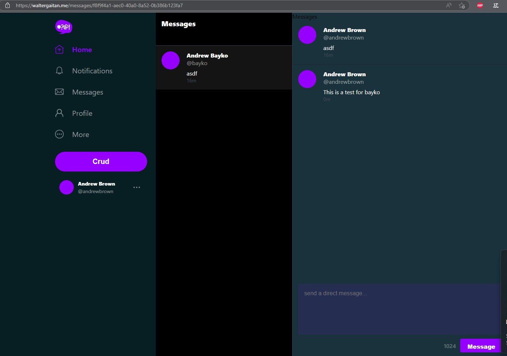
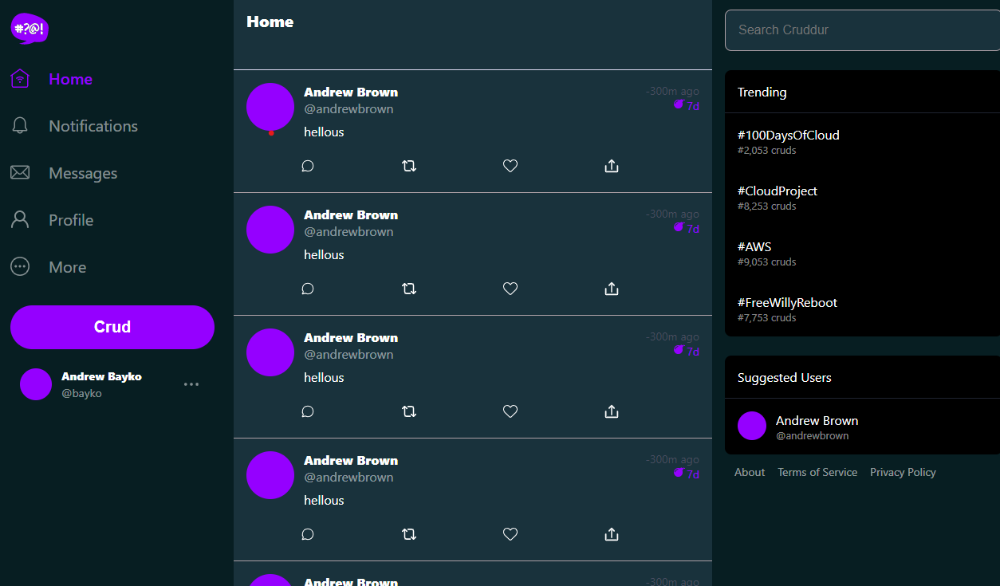
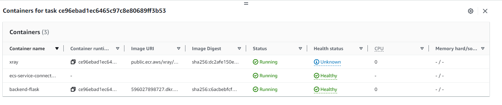

# Week 6 and 7 — Deploying Containers and solving CORS with a Load Balancer and Custom Domain

## Table of Contents

- [X] Watch ECS Security by Ashish
- [X] Watch Fargate Technical Questions with Maish
- [X] Provision ECS Cluster	
- [X] Create ECR repo and push image for backend-flask	
- [X] Deploy Backend Flask app as a service to Fargate	
- [X] Create ECR repo and push image for fronted-react-js	
- [X] Deploy Frontend React JS app as a service to Fargate	
- [X] Provision and configure Application Load Balancer along with target groups	
- [X] Manage your domain using Route53 via hosted zone	
- [X] Create an SSL certificate via ACM	
- [X] Set up a record set for naked domain to point to frontend-react-js	
- [X] Set up a record set for api subdomain to point to the backend-flask	
- [X] Configure CORS to only permit traffic from our domain	
- [X] Secure Flask by not running in debug mode	
- [X] Implement Refresh Token for Amazon Cognito	
- [X] Refactor bin directory to be top level	
- [X] Configure task definitions to contain x-ray and turn on Container Insights
- [X] Change Docker Compose to explicitly use a user-defined network
- [X] Create Dockerfile specifically for production use case
- [X] Using ruby generate out env dot files for docker using erb templates

## Tasks

### Watch ECS Security by Ashish
In this video, I learned about the following:
- ECS Security
- Best practices
- Create a new ECS cluster
- Push image using the CLI
- How to inspect repository using Snyk or AWS Inspector

### Watch Fargate Technical Questions with Maish (Not yet uploaded)

### Provision ECS Cluster
In this task, the following was done:
- Create a new ECS cluster named `cruddur`
- Create a new task definition 
- Create a new service using the CLI
```shell
aws ecs create-cluster \
--cluster-name cruddur \
--service-connect-defaults namespace=cruddur
```

### Create ECR repo and push image for backend-flask

- Create a new ECR repository named `backend-flask`
- Create a new ECR repository named `cruddur`
- Login to ECR using the CLI
- Push the `python:3.10-slim` image to the `cruddur` repository
- Create a new image named `backend-flask` using the `Dockerfile` in the `backend-flask` directory
- Push the `backend-flask` image to the `backend-flask` repository

### Deploy Backend Flask app as a service to Fargate
There are some prerequisites for this task:
-  Create a parameter with the following command
```shell
aws ssm put-parameter --type "SecureString" --name "/cruddur/backend-flask/AWS_ACCESS_KEY_ID" --value $AWS_ACCESS_KEY_ID
aws ssm put-parameter --type "SecureString" --name "/cruddur/backend-flask/AWS_SECRET_ACCESS_KEY" --value $AWS_SECRET_ACCESS_KEY
aws ssm put-parameter --type "SecureString" --name "/cruddur/backend-flask/CONNECTION_URL" --value $PROD_CONNECTION_URL
aws ssm put-parameter --type "SecureString" --name "/cruddur/backend-flask/ROLLBAR_ACCESS_TOKEN" --value $ROLLBAR_ACCESS_TOKEN
aws ssm put-parameter --type "SecureString" --name "/cruddur/backend-flask/OTEL_EXPORTER_OTLP_HEADERS" --value "x-honeycomb-team=$HONEYCOMB_API_KEY"
```
- Create a new file in the `policies` folder named `service-assume-role-execution-policy.json`
- Run the Execution role
```shell
aws iam create-role --role-name CruddurServiceExecutionPolicy --assume-role-policy-document "file://aws/policies/service-assume-role-execution-policy.json"
```
- Create a Role in the console by going to IAM > Roles, and attach an inline policy to `CruddurServiceExecutionRole` using the `CruddurServiceExecutionPolicy`
- Create a task by using the CLI:
```shell
aws iam create-role \
    --role-name CruddurTaskRole \
    --assume-role-policy-document "{
  \"Version\":\"2012-10-17\",
  \"Statement\":[{
    \"Action\":[\"sts:AssumeRole\"],
    \"Effect\":\"Allow\",
    \"Principal\":{
      \"Service\":[\"ecs-tasks.amazonaws.com\"]
    }
  }]
}"
```
```shell
aws iam put-role-policy \
  --policy-name SSMAccessPolicy \
  --role-name CruddurTaskRole \
  --policy-document "{
  \"Version\":\"2012-10-17\",
  \"Statement\":[{
    \"Action\":[
      \"ssmmessages:CreateControlChannel\",
      \"ssmmessages:CreateDataChannel\",
      \"ssmmessages:OpenControlChannel\",
      \"ssmmessages:OpenDataChannel\"
    ],
    \"Effect\":\"Allow\",
    \"Resource\":\"*\"
  }]
}
"
```
```shell
aws iam attach-role-policy --policy-arn arn:aws:iam::aws:policy/CloudWatchFullAccess --role-name CruddurTaskRole
aws iam attach-role-policy --policy-arn arn:aws:iam::aws:policy/AWSXRayDaemonWriteAccess --role-name CruddurTaskRole
```

- Create a new task definition named `backend-flask` using the `backend-flask.json` file in `aws/task-definitions`
- Create a new service named `backend-flask` using the `backend-flask-service.json` file in `aws/services`
- Create a security group using the following commands:
```shell
export DEFAULT_VPC_ID=$(aws ec2 describe-vpcs \
--filters "Name=isDefault, Values=true" \
--query "Vpcs[0].VpcId" \
--output text)
echo $DEFAULT_VPC_ID

export DEFAULT_SUBNET_IDS=$(aws ec2 describe-subnets  \
 --filters Name=vpc-id,Values=$DEFAULT_VPC_ID \
 --query 'Subnets[*].SubnetId' \
 --output json | jq -r 'join(",")')
echo $DEFAULT_SUBNET_IDS

export CRUD_SERVICE_SG=$(aws ec2 create-security-group \
  --group-name "crud-srv-sg" \
  --description "Security group for Cruddur services on ECS" \
  --vpc-id $DEFAULT_VPC_ID \
  --query "GroupId" --output text)
echo $CRUD_SERVICE_SG
```
- Add policy  `CloudWatchFullAccess` to `CruddurServiceExecutionRole`

After all of this, we can now create a new service using the `backend-flask-service.json` file in `aws/services` and then connect using 
```shell
aws ecs execute-command  \
--region $AWS_DEFAULT_REGION \
--cluster cruddur \
--task [taskID] \
--container backend-flask \
--command "/bin/bash" \
--interactive
```
- Edit security group to allow inbound traffic on port 4567 by using the following security group rules:
```
Type: PostgreSQL
Protocol: TCP
Port Range: 4567
Source: Custom
Custom: crud-srv-sg
Description: CRUDDUR-SERVICES
```
- Access the service by going to the URL `http://[public-ip]:4567/api/activities/home` I got the following:
```json
[
  {
    "created_at": "2023-04-03T22:02:53.593648",
    "display_name": null,
    "expires_at": "2023-04-13T22:02:53.593648",
    "handle": null,
    "likes_count": 0,
    "message": "This was imported as seed data!",
    "replies_count": 0,
    "reply_to_activity_uuid": null,
    "reposts_count": 0,
    "uuid": "2e3154fe-29cd-403f-8e55-1d16131d9002"
  }
]
```
#### Create an Application Load Balancer
To set up the load balancer, it is necessary to go to EC2 > Load Balancers > Create Load Balancer 
- Select Application Load Balancer
- Select the VPC
- Select the subnets
- Create a new security group called `cruddur-alb-sg` with the following rules:
```
Type: HTTP
Protocol: TCP
Port Range: 80
Source: Anywhere IPv4

Type: HTTPS
Protocol: TCP
Port Range: 443
Source: Anywhere IPv4

Type: Custom TCP
Protocol: TCP
Port Range: 4567
Source: Anywhere IPv4
Description: TMP1

Type: Custom TCP
Protocol: TCP
Port Range: 3000
Source: Anywhere IPv4
Description: TMP2
```
- Create security group for the load balancer
- Add Inbound rule for `crud-srv-sg` security group to allow traffic for the load balancer with the following rules:
```
Type: Custom TCP
Protocol: TCP
Port Range: 4567
Source: Custom
Custom: crud-alb-sg
Description: CRUDDUR-ALB
```
- Make sure that all the security groups have `All traffic` outbound rule
- Create a new target group with the following rules:
```
Basic configuration: IP address
Target Group Name: cruddur-backend-flask-tg
Protocol: HTTP
Port: 4567
Health Check Path: /api/health-check
Healthy Treshold: 3
```
- Leave Register Targets empty and click on Create
- Add a Listener for the backend with the following rules:
```
Protocol: HTTP
Port: 4567  
Default Action: Forward to cruddur-backend-flask-tg
```
- Go back to the Load Balancer and add a new listener with the following rules:
```
Protocol: HTTP
Port: 4567
Default Action: Forward to cruddur-backend-flask-tg
```
- Create a new target group with the following rules:
```
Basic configuration: IP address
Target Group Name: cruddur-frontend-react-js
Protocol: HTTP
Port: 3000
Healthy Treshold: 3
```
- Leave Register Targets empty and click on Create
- Add a Listener for the frontend with the following rules:
```
Protocol: HTTP
Port: 3000
Default Action: Forward to cruddur-frontend-react-js
```
- Create the Load Balancer
- Select the Load Balancer and go to the `Attributes` tab
- Add the following attributes:
```
Access Logs: Enabled
S3 Bucket: cruddur-alb-logs-[account-id]

```
- For the new bucket, go to S3 and create a new bucket with the following rules:
```
Bucket name: cruddur-alb-access-logs-[account-id]
Region: us-east-2
Block public access: Select the first two options
Check the box to acknowledge that the bucket will be public
Create bucket
```
- Go to `Permissions` tab and click on `Bucket Policy` to add the following:
```json
{
  "Version": "2012-10-17",
  "Statement": [
    {
      "Effect": "Allow",
      "Principal": {
        "AWS": "arn:aws:iam::[elb-account-id]:root"
      },
      "Action": "s3:PutObject",
      "Resource": "arn:aws:s3:::[bucket-name]/[prefix]/AWSLogs/[your-aws-account-id]/*"
    }
  ]
}
```
#### Update the backend service to use the load balancer
- Open the `backend-flask-service.json` file in `aws/json` and add the following lines:
```json
      "loadBalancers": [
        {
            "targetGroupArn": "arn:aws:elasticloadbalancing:us-east-2:596027898727:targetgroup/cruddur-backend-flask-tg/21f4b1e69cc2369f",
            "containerName": "backend-flask",
            "containerPort": 4567
        }
    ],
```
- Delete the `backend-flask` service and create a new one using the `backend-flask-service.json` file in `aws/services` by using the following command:
```shell
aws ecs create-service --cli-input-json file://aws/json/service-backend-flask.json
```
###  Create ECR repo and push image for fronted-react-js
- Create a `Dockerfile.prod` file in the `frontend-react-js` folder
- Add a `nginx.conf` file in the `frontend-react-js` folder
- Modify the `ConfirmationPage.js` and `RecoverPage.js` to use `setErrors` instead of `SetCognitoErrors`
- In the `frontend-react-js` folder, build the webpage by using `run npm build`
- Build the image by using the following command:
```shell
docker build \
--build-arg REACT_APP_BACKEND_URL="http://cruddur-alb-1290862037.us-east-2.elb.amazonaws.com:4567" \
--build-arg REACT_APP_AWS_PROJECT_REGION="$AWS_DEFAULT_REGION" \
--build-arg REACT_APP_AWS_COGNITO_REGION="$AWS_DEFAULT_REGION" \
--build-arg REACT_APP_AWS_USER_POOLS_ID="${REACT_APP_AWS_USER_POOLS_ID}" \
--build-arg REACT_APP_CLIENT_ID="${AWS_COGNITO_APP_CLIENT_ID}" \
-t frontend-react-js \
-f Dockerfile.prod \
.
``` 
- Tag the image by using the following command:
```shell
docker tag frontend-react-js
$ECR_FRONTEND_REACT_URL
```
- Push the image to ECR by using the following command:
```shell
docker push $ECR_FRONTEND_REACT_URL
```

### Deploy Frontend React app as a service to Fargate
- In `aws/task-definitions` create a new file called `frontend-react-js.json` 
- Run `aws ecs register-task-definition --cli-input-json file://aws/task-definitions/frontend-react-js.json`
- In `aws/json` create a new file called `service-frontend-react-js.json` 
- Create service by running `aws ecs create-service --cli-input-json file://aws/json/service-frontend-react-js.json`

- Go to the Load Balancer and add a new listener with the following rules:
```
Protocol: Custom TCP'
Port: 3000
Source: sg-0f9f9f9f9f9f9f9f9/cruddur-alb-sg
```

### Manage your domain using Route53 via hosted zone	
- Go to Route53 and create a new hosted zone with the following rules:
```
Domain name: app.[yourdomain.com]
Type: Public hosted zone
```
- Copy your nameservers and go to your domain provider, depending on the provider, the options change, in my case, I am using Name.com, so I need to go to the `Manage` tab and click on `Nameservers` and then `Custom Nameservers` then I need to paste the nameservers and click on `Save Changes`


### Create an SSL certificate via ACM
- Go to ACM and create a new certificate with the following rules:
```
Domain name: [yourdomain.com]
Domain name: *.[yourdomain.com]
Validation method: DNS
```
- After that, you might need to wait a few minutes for the certificate to be validated
- Go to the Load Balancer and add a new listener with the following rules:
```
Protocol: HTTP
Port: 80
Default Action: Redirect to HTTPS
Port: 443
```
- Go to the Load Balancer and add a new listener with the following rules:
```
Protocol: HTTPS
Port: 443
Default Action: Forward to cruddur-frontend-react-js
Choose the certificate you created
```
- Delete the listeners created in the previous steps for the target groups and click on `Save`
- Go to the Load Balancer and click on `Listeners` and then `Manage Rules` to add the following rules:
```
Host header: api.[yourdomain.com]
Target group: cruddur-backend-flask-tg
```
- In Route53, go to your hosted zone and click on `Create Record` and add the following rules:
```
Record name: api
Record type: Load Balancer Alias
Route traffic to: Alias to Application Load Balancer
Region: us-east-2
Load Balancer: dualstack.cruddur-alb-1290862037.us-east-2.elb.amazonaws.com
Create records
```
### Set up a record set for naked domain to point to frontend-react-js
- Go to `aws/task-definitions` and open the `backend-flask.json` file
- Modify the `FRONTEND_URL` environment variable to use the new domain to point to `[yourdomain.com]`
- Do the same with `BACKEND_URL` environment variable to point to `api.[yourdomain.com]`
- Run `aws ecs register-task-definition --cli-input-json file://aws/task-definitions/backend-flask.json`

### Set up a record set for api subdomain to point to the backend-flask
- Do the same with the `frontend-react-js.json` file and modify the `REACT_APP_BACKEND_URL` environment variable to point to `api.[yourdomain.com]` like this:
```shell
docker build \
--build-arg REACT_APP_BACKEND_URL="api.[yourdomain.com]" \
--build-arg REACT_APP_AWS_PROJECT_REGION="$AWS_DEFAULT_REGION" \
--build-arg REACT_APP_AWS_COGNITO_REGION="$AWS_DEFAULT_REGION" \
--build-arg REACT_APP_AWS_USER_POOLS_ID="${REACT_APP_AWS_USER_POOLS_ID}" \
--build-arg REACT_APP_CLIENT_ID="${AWS_COGNITO_APP_CLIENT_ID}" \
-t frontend-react-js \
-f Dockerfile.prod \
.
```
- Tag the new image and push it to ECR
- In ECS, go to `Services` and update the `backend-flask` and `frontend-react-js` service 

### Secure Flask by not running in debug mode
- Create a `Dockerfile.prod` file and make sure to add the following:
```dockerfile
FROM 596027898727.dkr.ecr.us-east-2.amazonaws.com/cruddur-python:3.10-slim-buster

# Inside Container
# make a new folder inside container
WORKDIR /backend-flask

# Outside Container -> Inside Container
# this contains the libraries want to install to run the app
COPY requirements.txt requirements.txt

# Inside Container
# Install the python libraries used for the app
RUN pip3 install -r requirements.txt

# Outside Container -> Inside Container
# . means everything in the current directory
# first period . - /backend-flask (outside container)
# second period . /backend-flask (inside container)
COPY . .

# Set Environment Variables (Env Vars)
# Inside Container and wil remain set when the container is running
ENV FLASK_DEBUG=1

EXPOSE ${PORT}

# CMD (Command)
# python3 -m flask run --host=0.0.0.0 --port=4567
CMD [ "python3", "-m" , "flask", "run", "--host=0.0.0.0", "--port=4567", "--no-debug", "--no-debugger", "--no-reload"]
```

### Fix Messaging in Production
- Add the following in line 82 for `db.py`:
```python
return "{}"
```
- Refactor multiple scripts and make sure that they point to the right direction, specially setup, seed, and schema load
- Add scripts to kill all connections from DB, this is meant by use in development only
- Restructure scripts to have a more organized view 

#### Update the `cognito_users_ids` table

When using the messaging option, you have to make sure to update the `cognito_users_ids` since they have `MOCK` in production, to do that, you have to go to the `cognito_users` table and update the `cognito_user_id` to the one you have in the `cognito_users_ids` table. For this, I did the following:
- Connect to the DB using `./bin/db/connect prod`
- Run the following query to get the `cognito_user_id` from the `cognito_users` table:
```sql
SELECT * FROM users;
```
- I got the cognito_user_id from the `users` table by running `./bin/db/setup` in the `cruddur` database
- Once I did that, I accessed the `cruddur` database and ran the following query to get the `cognito_user_id` from the `cognito_users` table:
```sql
SELECT * FROM cognito_users;
```
This is the result I got:
```sql
                 uuid                 | display_name  |    handle     |          email           | cognito_user_id  |  created_at         
--------------------------------------+---------------+---------------+--------------------------+--------------------------------------+----------------------------
 450f601b-5a16-457a-a36d-20f06cf07cb2 | Andrew Brown | andrewbrown | walterg.steven@gmail.com | MOCK             | 2023-04-19 16:09:07.046622
 8d7902b7-790c-4c39-8fae-1086ce79b32e | Walter Gaitan  | waltergsteven   | andrew@exampro.co        | MOCK             | 2023-04-19 16:09:07.046622
 f6088bcb-5ba8-4e62-843a-06c050979b16 | Andrew Bayko  | bayko         | bayko@exampro.co         | MOCK             | 2023-04-19 16:09:07.046622
(3 rows)
```
- Run the following query to update the `cognito_user_id` in the `users` table:
```sql
UPDATE public.users 
SET cognito_user_id = 
  CASE 
    WHEN handle = 'waltergsteven' THEN '[your-cognito-user-id]'
    WHEN handle = 'bayko' THEN '[your-cognito-user-id]'
  END
WHERE handle IN ('waltergsteven', 'bayko');
```
- Once done, you can run the following query to verify that the `cognito_user_id` was updated:
```sql
SELECT * FROM users;
```
- This is the result I got:
```sql
                 uuid                 | display_name  |    handle     |          email           |           cognito_user_id            |         created_at         
--------------------------------------+---------------+---------------+--------------------------+--------------------------------------+----------------------------
 450f601b-5a16-457a-a36d-20f06cf07cb2 | Walter Gaitan | waltergsteven | walterg.steven@gmail.com | MOCK                                 | 2023-04-19 16:09:07.046622
 8d7902b7-790c-4c39-8fae-1086ce79b32e | Walter Gaitan  | waltergsteven   | andrew@exampro.co        | 7534a7af-a7e2-44df-aebe-44bd8240d449 | 2023-04-19 16:09:07.046622
 f6088bcb-5ba8-4e62-843a-06c050979b16 | Andrew Bayko  | bayko         | bayko@exampro.co         | c10ce10e-599d-497c-8dc3-104498faee9a | 2023-04-19 16:09:07.046622
(3 rows)
```

#### Check that messaging is working in production
- Go to your frontend app and login with the `waltergsteven` user, or whichever user you want to use as long as it has a `cognito_user_id` in the `users` table
- Go to `Messages`
- In the address bar, add the following: `/new/[username]` where `[username]` is the username of the user you want to send a message to
- You should see the following:
- 
- Add a new message and click `Message`
- You should see the following:
- 

### Implement Refresh Token for Amazon Cognito (Backend)
- The implementation will be done in the `frontend` app
- Modify `CheckAuth` component to check if the token is expired and if it is, then refresh the token
- Modify the `MessageForm` to get the `AccessToken` from the `localStorage` and send it to the backend
- Modify the `HomeFeedPage` to get the `AccessToken` from the `localStorage` and send it to the backend
- Modify the `MessageGroupNewPage`, `MessageGroupPage`, and `MessageGroupsPage` to get the `AccessToken` from the `localStorage` and send it to the backend
- The result should be the following:


### Configure task definitions to contain x-ray and turn on Container Insights
- Go to `backend-flask.json` and add the following:
```json
    {
      "name": "xray",
      "image": "public.ecr.aws/xray/aws-xray-daemon" ,
      "essential": true,
      "user": "1337",
      "portMappings": [
        {
          "name": "xray",
          "containerPort": 2000,
          "protocol": "udp"
        }
      ]
    },
```
- Create a register script for the `backend-flask` task definition as well as the `frontend` task definition
- Now, it is time to recreate the task backend definition, as well as redeploy the service
  - After a while, you should see the following in the backend tasks:
  
- The problem is that the health check is failing, so we need to modify the `backend-flask` task definition to add the `xray` container
- Modify the `backend-flask.py` and comment the mock data 
- Create a `run` script for the frontend

### Configure task definitions to contain x-ray and turn on Container Insights
- Modify the `backend-flask` task definition to use the environment files
- Modify the `frontend` task definition to use the environment files
- Add X-Ray to the `frontend` task definition
- Register and deploy the tasks definitions and services
- Wait and check that the services are running
- Finally, go to `Update Cluster` and enable `Container Insights`

> Note: As of now, the `frontend` app is not sending the `AccessToken` to the backend, so the `xray` container is not showing any data

### Watch Fargate Technical Questions with Maish Saidel-Keesing
- During the video docker networking was discussed, best practices on deploying containers, and how to troubleshoot networking issues
- Use cases for using bridge networking mode

### Using ruby generate out env dot files for docker using erb templates
- Create a `generate-env` script for the `backend-flask` app
- Create a `generate-env` script for the `frontend` app
- Create scripts to automatically generate the environment files for the `backend-flask` and `frontend` apps

### Implement timezones in the frontend
- Modify the `MessageGroupItem` to show the time in the user's timezone
- Modify the `MessageItem` to show the time in the user's timezone
- Create a `DateTimeFormat` component to format the date and time
- Modify `seed.py` to add the `timezone` to the `users` table
- Modify `ddb.py` to add the `timezone` to the `users` table