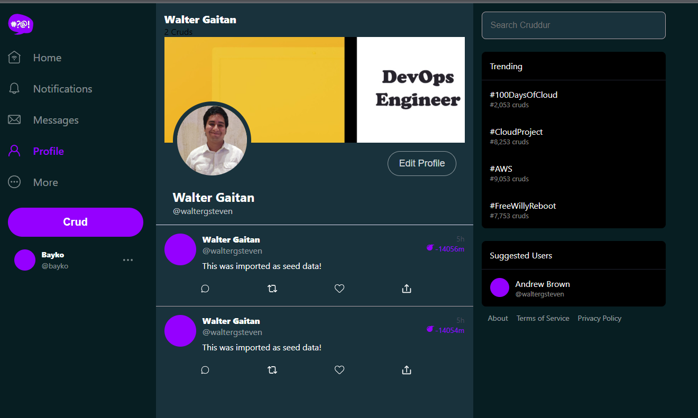

# Week 8 — Serverless Image Processing

## Overview

This week we will be using the [Serverless Framework](https://serverless.com/) to create a serverless image processing pipeline. We will be using the [AWS Lambda](https://aws.amazon.com/lambda/) service to run our code, and [AWS S3](https://aws.amazon.com/s3/) to store our images. We will also be using the [AWS Rekognition](https://aws.amazon.com/rekognition/) service to perform image analysis.

## Pre-requisites
- Amazon CDK installed and configured

## Table of Contents

- [X] Implement CDK Stack	
- [X] Serve Avatars via CloudFront	
- [X] Implement Users Profile Page
- [X] Implement Users Profile Form	
- [X] Implement Backend Migrations	
- [X] Presigned URL generation via Ruby Lambda	
- [X] HTTP API Gateway with Lambda Authorizer
- [X] Create JWT Lambda Layer
- [X] Render Avatars in App via CloudFront

### Implement CDK Stack

- For this, we will follow week 8 - Serverless Image Processing and copy all the files from the thumbing-serverless-cdk folder into our project. We will also need to install the following dependencies:

```bash
      npm install aws-cdk -g
      cd thumbing-avatar-cdk
      cp .env.example .env
      npm i
```
> Note: To create a new CDK project, you can use the following command:
```bash
cdk init app --language=typescript
```
You can integrate this in your gitpod.yml file as well.
- It is necessary to change the `.env` file based on the `env.example` to use your own s3 bucket name and URL
- Synthesize the CDK stack:
```bash
      cdk synth
```
- Bootstrap the CDK stack and make sure you are using the correct AWS account and region:
```bash
      cdk bootstrap "aws://$AWS_ACCOUNT_ID/$AWS_REGION"
```
> **Note:** Make sure to use a version of Node.js that is supported by AWS Lambda. At the time of writing, the latest version of Node.js supported by AWS Lambda is 18.0, you can install it with nvm:
```bash
# install nvm
curl -o- https://raw.githubusercontent.com/nvm-sh/nvm/v0.39.0/install.sh | bash
# install node 18
nvm install 18.0.0
```
- After doing so, you should be able to see the bucket created, make sure you are located in the right region using the AWS console

- Deploy the CDK stack:
```bash
cdk deploy
```
- You should be able to see the following output:

- Confirm that you want to deploy the stack by typing `y` and pressing enter
- If the deployment was successful, you should be able to see the following output:

- Install the process-image dependencies:
```bash
cd process-image
npm i
npm install -g aws-cdk
npm i @aws-sdk/client-s3
```
- Install the node_modules for aws lambda:
```bash
npm install
rm -rf node_modules/sharp
SHARP_IGNORE_GLOBAL_LIBVIPS=1 npm install --arch=x64 --platform=linux --target=12.13.0 sharp
```
- Make sure that your bucket is already created in s3, if not, create it manually
- Deploy the process-image stack:
```bash
cdk deploy
```
- In your assets bucket, create a folder `original` and `processed`
- upload an image to the `original` folder called `data.jpg`
- setup and env called DOMAIN_NAME in your environment variables

### Serve Avatars via CloudFront
- In your AWS console, go to CloudFront and create a new distribution
```
Origin Domain Name: <your-bucket-name>.s3.amazonaws.com
Name: <your-bucket-name>
Origin Access: Origin Access control setting
```
> **Note:** You must create a control setting to continue
```
Default Cache Behavior Settings: Use legacy cache settings
Viewer Protocol Policy: Redirect HTTP to HTTPS
Origin Request Policy: CORS-CustomOrigin
Response Headers Policy: Simple CORS
```
- Create an ACM certificate in the us-east-1 region and validate it
```
Custom SSL Certificate: <your-certificate>
Add a description: <your-certificate>
```
- You might need to wait a few minutes for the distribution to be deployed
- Create a new record set in Route53
```
Name: assets.<your-domain-name>
Type: A - IPv4 address'
Route traffic to: Alias to CloudFront distribution
```
- Make sure that `data.jpg` is uploaded to the `original` folder in your bucket
- Add the following policy to your bucket:
```json
{
    "Version": "2008-10-17",
    "Id": "PolicyForCloudFrontPrivateContent",
    "Statement": [
        {
            "Sid": "AllowCloudFrontServicePrincipal",
            "Effect": "Allow",
            "Principal": {
                "Service": "cloudfront.amazonaws.com"
            },
            "Action": "s3:GetObject",
            "Resource": "arn:aws:s3:::assets.waltergaitan.me/*",
            "Condition": {
                "StringEquals": {
                  "AWS:SourceArn": "arn:aws:cloudfront::596027898727:distribution/ERP1HKKVALIMN"
                }
            }
        }
    ]
}
```
- Change the `DOMAIN_NAME` in your `.env` file to the domain name of your CloudFront distribution
- Modify your `thumbing-serverless-cdk-stack.ts` file to use your CloudFront distribution
- Modify `serverless` folder to be `avatar` instead and modify the scripts as well
- Upload file using script to test if it works
```bash
./bin/avatar/upload
```

### Implement Users Profile Page
- Create a new page called `ProfilePage` in the `pages` folder
- Create a new component called `Profile` in the `components` folder
- Create a new component called `Avatar` in the `components` folder
- Make sure to upload the `data.jpg` file to your bucket folder `avatar`
- Do the same for the banner image
- Modify the `ProfilePage` to use the `Profile` component
- Modify the Backend `Dockerfile` in the last line:
```dockerfile
CMD [ "python3", "-u", "-m", "flask", "run", "--host=0.0.0.0", "--port=4567", "--debug"]
```
- Modify your `app.py` file to use the new `ProfilePage` component and do the same for your `user_activities.py` file
- Create a new sql file called `users` located in `db/sql` folder

Once everything is done, you should be able to see the following:

> **Note:** Make sure that you don't have your adblocker enabled, otherwise you won't be able to see the banner image

### Implement Migrations Backend Endpoint and Profile Form
- Modify your `app.py` file to use the new `update_profile` endpoint
- Create a migrations folder in your `db` folder
- modify your schema to add the following columns:
```sql
UPDATE public.users 
SET 
  bio = %(bio)s,
  display_name= %(display_name)s
WHERE 
  users.cognito_user_id = %(cognito_user_id)s
RETURNING handle;
```
- Add a new `update.sql` file in your `sql/users` folder and modify your `show.sql` file to include the `users.bio`
- Modify your `db.py` file to include the new `update` and `show` methods
- Create a new `update_profile.py` file in your `backend` folder
- Create a migrate function in `db` folder and create a `rollback` function as well
- Create a new folder `bin/generate` and create a new file called `migration` and another one called `prepare`
- Create a `Popup.css` file and import it to your `App.js` file
- Also add a `ProfileForm.css` file and import it to your `ProfileForm.js` file which you need to create as well
- Make some modifications to the `HomeFeedPage.js` imports 
- Add a ProfileForm component to your `UserFeedPage.js` file

### Implement Avatar Upload
- Create a new Gemfile and Gemfile.lock for a new lambda
- Create a folder called `lambda-authorizer` and create and index.js, package.json and package-lock.json file
- Create a new policy for the avatar upload 
- Modify the components for Profileform
- Build an http API for the avatar upload
```
Lambda
AWS Region: [your-region]
Lambda Function: avatar-upload
API name: cruddur.com
```
- Create a new lambda function called `CruddurAvatarUpload` and create a new http API
```
Function name: CruddurAvatarUpload
Runtime: Ruby 2.7
Execution role: Create a new role with basic Lambda permissions
```
- Copy your `function.rb` file to your lambda function
- do a bundle install 